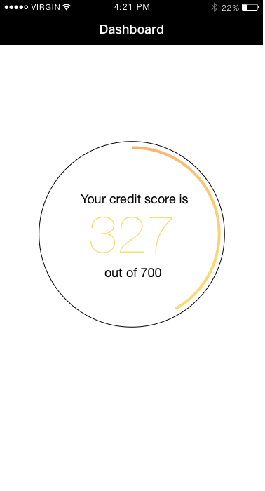

# ClearScore
> iOS Technical assessment

[![Swift Version][swift-image]][swift-url]
[![Build Status][travis-image]][travis-url]
[![License][license-image]][license-url]

Write an application that will display a donut view which pulls the credit score information from the endpoint given. The wire frame shows an example of what is to be achieved. 
The donut should display the correct value received from the endpoint and use that value to fill the outline of the donut but the same percentage.

## Features

- [x]  Pulls credit score informations from endpoint given
- [x]  Updates the UI to display current score information
- [x]  Animates content nicely

## To-Dos

- [ ]  Add gradient to Donut view
- [ ]  Animate text color depending on score percentage
- [ ]  Complete documentation
- [ ]  Unit tests

## Requirements

- It should compile and run.
- The code should be production grade.

## Tips/Advise
- Testing is very important for us and you should take that into consideration when creating this demo. Even if you don't write a single test (e.g. because of time constraints), your app should be easy to test.

- Error scenarios should be taken into consideration as well and how easy is to add them, even if you don't explicitly show them (e.g. using an UIAlertController).

- Although UI and UX are important, in this demo, we are more concerned on how you architect your application and your thought process. It should take into consideration features that might be added in the future.

- You can use any 3rd party library you wish (Alamofire, ReactiveCocoa, PromiseKit, Realm, etc). In case you do, be prepared to justify why you used it. You can use CocoaPods, Carthage or Git Submodules for this (please don't drag and drop stuff around).

Clean the file project structure (if you are creating one from scratch) and remove any unused methods (e.g AppDelegate).

## Meta

Luca Silvestro – [Follow me on Linkedin](https://www.linkedin.com/in/luca-silvestro-49199740/)

[swift-image]:https://img.shields.io/badge/swift-4.0-orange.svg
[swift-url]: https://swift.org/
[license-image]: https://img.shields.io/badge/License-MIT-blue.svg
[license-url]: LICENSE
[travis-image]: https://img.shields.io/travis/dbader/node-datadog-metrics/master.svg?style=flat-square
[travis-url]: https://travis-ci.org/dbader/node-datadog-metrics
[codebeat-image]: https://codebeat.co/badges/c19b47ea-2f9d-45df-8458-b2d952fe9dad
[codebeat-url]: https://codebeat.co/projects/github-com-vsouza-awesomeios-com
